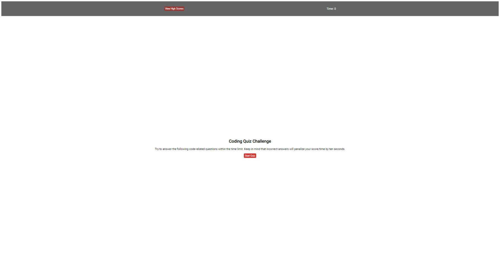

# Javascript Code Quiz

## Overview

The following generates a quiz.

GIVEN I am taking a code quiz
WHEN I click the start button
THEN a timer starts and I am presented with a question
WHEN I answer a question
THEN I am presented with another question
WHEN I answer a question incorrectly
THEN time is subtracted from the clock
WHEN all questions are answered or the timer reaches 0
THEN the game is over
WHEN the game is over
THEN I can save my initials and score


## File Structure

##### root

```shell
   |-- assets
```

#### assets
```shell
|-- assets
    |-- audio
    |-- css
    |-- js
```

`root/`

- Contains HTML;


`assets/`

- Contains CSS, Javascript, Audio files;


## Remote Site

The remote site is used for display and hosted on GitHub Pages

##### The remote site is located here:
*Home Page*<br>[https://github.com/bulkacity/Web_Quiz/settings/pages](https://github.com/bulkacity/Web_Quiz/settings/pages)

### Screenshot


